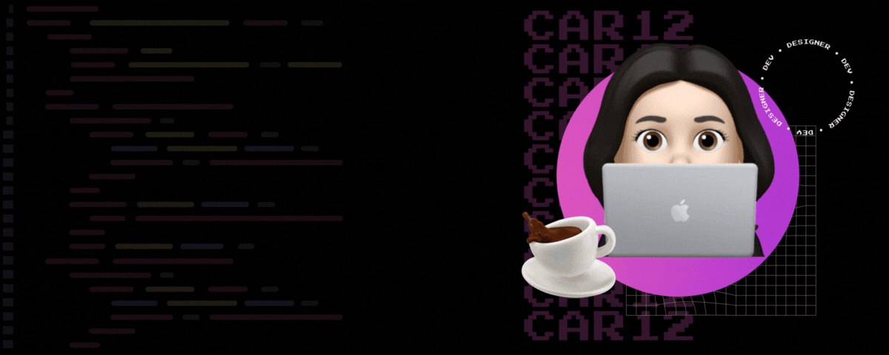

  

<h1 align="center">Hi there, I'm Gabi 👋</h1>

  Hi! I'm Gabi, graduated in Communication and specialized in Graphic Design. I bring in my pink suitcase several years of experience. My journey as a designer goes beyond creativity and aesthetics, extending to front-end development, where I am constantly and enthusiastically expanding my knowledge to turn my design into functional code. My goal is to transform creative concepts into visually stunning and technically solid projects.

  🚀 Let's create something amazing! ✨

<h2 align='center'>💻 Languages & Tools</h2>

   

<h2 align='center'>📊 My Github Stats</h2>

